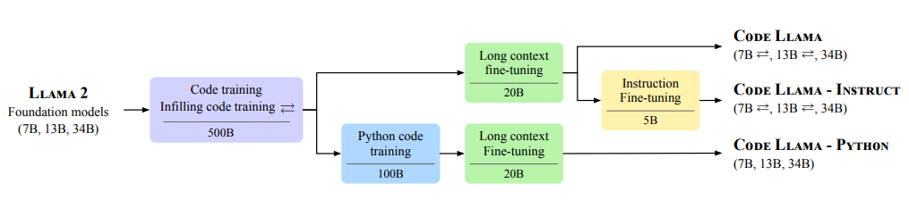
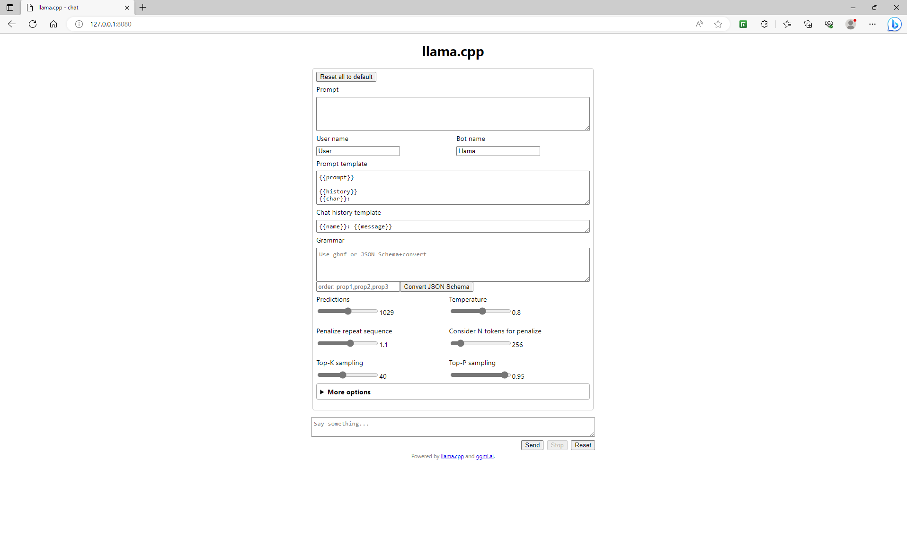
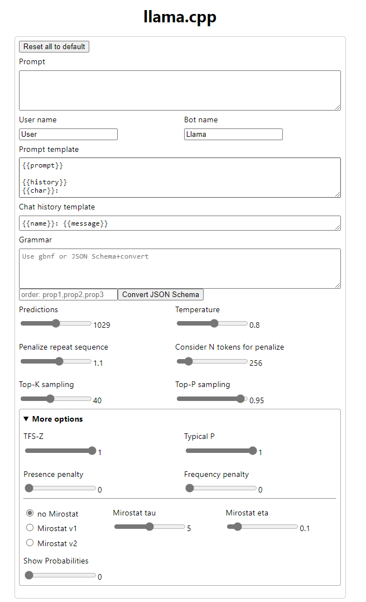

# LLaMa 2 LLM How to Get, Fine-Tune and Deploy from Scratch

## What is a Large Language Model
Large Language Models (LLMs) are a type of artificial intelligence (AI) model that can generate and understand text in a human-like way. They are trained on massive datasets of text and code, and can be used for a variety of tasks, such as:

- Text Generation
- Translation
- Question Answering
- Summarization
- Sentiment Analysis

LLMs have the potential to revolutionize the way we interact with computers.

---

## What is Llama 2

Llama 2 is an open source LLM developed by Meta AI. It is the successor to Llama 1, and is trained on a massive dataset of text and code. Llama 2 is significantly larger and more powerful than Llama 1, with 2 trillion tokens and double of context length.

| Specifications | Llama 2 | Llama 1 |
|---|---|---|
| Model size | 2 trillion tokens | 1 trillion tokens |
|Context length | 248 tokens | 124 tokens |
| Number of parameters | 176 billion | 88 billion |
| Training dataset | Massive dataset of code and text | Massive dataset of text|
| Training method | Reinforcement learning from human feedback | Supervised learning |
| Performance | Significantly better than Llama 1 on a variety of tasks, including text generation, translation, question answering, summarization and sentiment analysis | Worse than Llama 2 on aforementioned tasks |
| Availability | Open source | Open source |

Llama 2 is designed to be helpful and safe, and is trained using reinforcement learning from human feedback. It is available for research and commercial use, and is already being used by developers to build new and innovative applications.

Here are some examples that Llama 2 can do:

- Generate text, translate langugaes, write different kinds of creative content, and answer your questions in an informative way.
- Chat with users in a natural and engaging way.
- Generate code.
- Solve problems.
- Learn and adapt over time.

Llama 2 has two main types of models: Default models and Chat models.

<b>Default models</b> are pre-trained on a massive dataset of text and code, and can be adapted for a variety of natural language generation tasks. They are not specificallty designed for dialogue use cases.

<b>Chat models</b> are fine-tuned on dialogue datasets, and are optimized for dialogue use cases. It can be said that, chat models are fine-tnued versions of default models. This fine-tuning allow the chat models to learn the specific patterns and conventions of human dialogue. As a result of this, they can generate more natural and engaging conversations with users.

| Model type | Training dataset | Fine-tuned on dialogue dataset? | Intended use cases |
|---|---|---|---|
| <b>Default model</b> | Massive dataset of text and code | No | Text generation, translation, question answering, summarization, and sentiment analysis |
| <b>Chat model</b> | Massive dataset of text and code + dialogue dataset | Yes | Dialogue, customer service, and other assistant-like tasks |

<b>Default models</b> are better suited for tasks that require a broad understanding of language, such as text generation, translation, question answering and summarization. They can also be used for tasks that require a deep understanding of a specific domain, such as summarizing scientific papers or writing technical documentation.

<b>Chat models</b> are better suited for tasks that require natural and engaging conversations with users, such as customer service chatbots and virtual assistants. They can also be used for tasks that require creativity and humor, such as writing scripts for chatbots or generating creative content. 

Which type of model is best for a particular task depends on the specific requirements of the task.

#### <b>Size of the Models:</b> 
Llama 2 is available in three sizes: <b>7B, 13B, and 70B</b>. The number indicates the number of parameters in the model. Parameters are the adjustable elements of a model that control its behaviour. More parameters typically means that the model can learn more complex patterns in the data.

- <b>7B model:</b> The 7B model is the smallest of the three models. It has 7 billion parameters and is designed for tasks that require a moderate amount of language understanding and generation capacity. It can be used for tasks such as text generation, question answering, summarization and sentiment analysis.

- <b>13B model:</b> The 13B model is the medium-sized model. It has 13 billion parameters and is designed for tasks that require a high level of language understanding and generation capacity. It can be used for tasks suchs as generating creative text formats, writing different kinds of creative content, and answering your questions in an informative way, even if they are open ended, challenging, or strange.

- <b>70B model:</b> The 70B model is the largest of the three models. It has 70 billion parameters and is designed for tasks that require the most advanced language understanding and generation capacity. It can be used for tasks such as generating code, solving problems, and learning and adapting over time.

Which size model is best for a particular task depends on the specific requirements of the task. For example, if you need a model that can generate text that is both informative and engaging, then the 13B and 70B model may be a better choice. If you need a model that can translate text from one language to another with high accuracy, then the 7B model may be a better choice.

It is also important that, since the models are getting bigger and bigger over the time, make sure that the hardware component that is used to make the model run needs to meet the requirements.

| Model | Memory Usage |
|---|---|
| <b>7B</b> | 13.2 GB |
| <b>13B</b> | 25.4 GB |
| <b>70B</b> | 138 GB |

#### <b>Important Note:</b> 
Default models are unfiltered and unsafe for usage if we compare wit the chat models. Because as explained in <b>Llama 2:  Open Foundation and Fine-Tuned Chat Models [x]</b>,  default models fine-tuned according to <b>helpfulness</b> and also <b>safety</b> to make chat models. Llama 2 chat models are intended to be as safe as possible while trying to be as helpful as possible. As a results of this, chat models have a filter like structure that detects the harmful or unsafe content and makes model to not answer these topics. Even the topics are safe but the words are unsafe, the model again does not answer these questions. Meta AI wants to be sure about chat models' safetiness while making it open source. Since default models does not contain that much safetiness, fine-tuning operations can be done to this default models in some usage cases.

---

## What is Code Llama

Code Llama is a code generation model built on Llama 2, trained on 500 billion tokens of code. It supports common programming languages being used today, including Python, C++, Java, PHP, Typescript(Javascript), C#, and Bash.

Code Llama can generate code from both code and natural language prompts, such as:

- "Write a function that calculates the Fibonacci sequence."
- "Translate this Python code to C++."
- "Fix the bug in this Javascript code."

Code Llama can also be used for code completion and debugging.

Here are some examples of how Code Llama can be used:

- A beginner programmer can use Code Llama to generate code snippets that they can then copy and paste into their own code.
- An experienced programmer can use Code Llama to generate code templates or boilerplate code.
- A software engineer can use Code Llama to help them debug their code or to generate test cases.
- A researcher can use Code Llama to explore new programming ideas or to generate code for experiments.

Code Llama divided into 3 usage ares:

- Code Llama (default form)
- Code Llama Instruct (default model fine-tuned especially to make an instruction following model)
- Code Llama Python (default model fine-tuned especially for python)

Below, the chart of the training and the differences of the models can be seen.

- <b>Code Llama</b>: On default, a foundation model is trained according to 500 billion tokens of code. Then, if only fine-tuned over long context fine-tuning with 20 billion, the resultant model will be Code Llama Default. 

- <b>Code Llama Instruct</b>: After long context fine-tuning, if the instruction fine-tuning with 5 billion tokens occurs, then the resultant model will be Code Llama Instruct. 

- <b>Code Llama Python</b>: Before long context fine-tuning, if the python code training with 100 billion tokens of code occurs, and then long context fine-tuning occurs, the resultant model will be Code Llama Python.

| Model type | Training dataset | Fine-tuned on instructions? | Fine-tuned on Python code? | Intended use cases |
|---|---|---|---|---|
| <b>Code Llama</b> | Massive dataset of text and code | No | No | A variety of code generation tasks, such as generating code snipptets, translating code between languages, and fixing bugs |
| <b>Code Llama Instruct</b> | Massive dataset of text and code + natural langugae instruction dataset | Yes | No | Generating code from natural language descriptions, such as writing code to implement a new feature or fix a bug |
| <b>Code Llama Python</b> | Massive dataset of text and code + Python dataset | No | Yes | Generating Python code, such as writing code templates or boilerplate code |

#### <b>Size of the Models:</b> 
Code Llama is available in three sizes: <b>7B, 13B, and 34B</b>. The number indicates the number of parameters in the model. As with Llama 2, more parameters typically means that the model can learn more complex patterns in the data.

- <b>7B model:</b> The 7B model is the smallest of the three models. It has 7 billion parameters and is designed for tasks that require a moderate amount of language understanding and code generation capacity. It can be used for tasks such as generating code snippets, translating code from one language to another, and fixing simple bugs.

- <b>13B model:</b> The 13B model is the medium-sized model. It has 13 billion parameters and is designed for tasks that require a high level of language understanding and code generation capacity. It can be used for tasks suchs as generating more complex code snippets, translating code from one language to another, and fixing more complex bugs.

- <b>34B model:</b> The 34B model is the largest of the three models. It has 70 billion parameters and is designed for tasks that require the most advanced language understanding and code generation capacity. It can be used for tasks such as generating code that is both efficient and idiomatic, translating code between any two programming languages, and fixing even more complex bugs.

Which size model is best for a particular task depends on the specific requirements of the task. For example, if you need a model that can generate code snippets that are both correct and efficient, then the 13B or 34B model may be a better choice. If you need a model that can translate code between a few popular programming languages with high accuracy, then the 7B model may be a better choice.

| Model size | Code generation quality | Code translation accuracy | Code debbuging accuracy |
|---|---|---|---|
| <b>7B</b> | Good | Good | Fair |
| <b>13B</b> | Excellent | Excellent | Good |
| <b>34B</b> | State-of-the-art | State-of-the-art | Excellent |

It is also important that, since the models are getting bigger and bigger over the time, make sure that the hardware component that is used to make the model run needs to meet the requirements.

| Model | Memory Usage |
|---|---|
| <b>7B</b> | 13.2 GB |
| <b>13B</b> | 25.4 GB |
| <b>34B</b> | 65.9 GB |

---

## How to get Llama 2

- To get the Llama 2 LLMs, go to Meta AI's official webpage (ai.meta.com/llama) and fill the asked information.
- Approximately, 1 hours later (it can go up to 2 days), you will receive links about demanded models in your email. 
- By following these links, the models raw forms can be downloaded.

or

- You can login Hugging Face with the same email that you have filled the Meta AI's form and go to meta-llama page (huggingface.co/meta-llama). Request the models on that page. In 1 day, you will granted access to directly download the whole models in that website by seeing them one by one.

- On the page, download everything except ".safetensors" files.

To concate Binary files (.bin) or convert PyTorch (.pth) weights, we need to concate or convert these into .bin or .gguf format (.ggml format is no longer supported.).

---

## How to Deploy the Model and make it work

Via a inference named llama.cpp (written in pure C/C++), we are able to monitor and also use the models. Especially on local computers, without any internet access, this inference works like a charm. With its server.exe file inside the folder after you build it, you are able to open a local server in your computer in order to use this model interactive and easily. 

On llama.cpp github page (http://github.com/ggerganov/llama.cpp) requirements and how to build are written. By following these steps, you are able to build llama.cpp properly in your local desktop. By this build, only CPU is in use. If you want to turn on GPU accelerations or accelerate your CPU, go to <b>Accelerators for GPU and CPU</b> part of this page.

---

## How to convert the pytorch weights to gguf or bin format in order to run

- After you have build the llama.cpp inference, inside the llama.cpp folder on you desktop or wherever you located, there are some pyhton code and also executable files. 

- Aforementioned, to make PyTorch weights work, we need to convert these into .bin or .gguf format. To do this, we can open the command prompt and go where the llama.cpp folder located. 

- Inside that folder, write down the following command on command prompt 

        python convert.py path_to_demanded_models_PyTorch_weights

- You will receive a file named "ggml-model-f16.gguf". This file can be executed (If the file is too large to work on it, follow the <b>How to quantize the model in order to make it more memory efficient to run</b> part of this page.).

---

## How to quantize the model in order to make it more memory efficient to run

- To quantize the model that you want, for example, "ggml-model-f16.gguf", we again need to open the command prompt and go where the llama.cpp folder located.

- Inside that folder, write down the following command on command prompt

        quantize ".gguf_models_path" "demanded_path_for_model_and_its_name" quantization_method

        For example, quantize ./models/7b-model/ggml-model-f16.gguf ./models/7b-model/7b-model-q5_K_M.bin q5_K_M

- To decide which quantization method you are going to use, you need to look up to the following table.

<b>Allowed quantization types:</b>
| Name | Quant method | Bits | Use case |
|---|---|---|---|
| llama-2-x.Q2_K.gguf | Q2_K | 2 | smallest, significant quality loss - not recommended for most purposes|
| llama-2-x.Q3_K_S.gguf | Q3_K_S | 3 | very small, high quality loss |
| llama-2-x.Q3_K_M.gguf | Q3_K_M | 3 | very small, high quality loss |
| llama-2-x.Q3_K_L.gguf | Q3_K_L | 3 | small, substantial quality loss |
| llama-2-x.Q4_0.gguf | Q4_0 | 4 |  legacy; small, very high quality loss - prefer using Q3_K_M |
| llama-2-x.Q4_K_S.gguf | Q4_K_S | 4 | small, greater quality loss |
| llama-2-x.Q4_K_M.gguf | Q4_K_M | 4 | medium, balanced quality - recommended |
| llama-2-x.Q5_0.gguf | Q5_0 | 5 | legacy; medium, balanced quality - prefer using Q4_K_M |
| llama-2-x.Q5_K_S.gguf | Q5_K_S | 5 | large, low quality loss - recommended |
| llama-2-x.Q5_K_M.gguf | Q5_K_M | 5 | large, very low quality loss - recommended|
| llama-2-x.Q6_K.gguf | Q6_K | 6 | very large, extremely low quality loss |
| llama-2-x.Q8_0.gguf | Q8_0 | 8 | very large, extremely low quality loss - not recommended|
| llama-2-x.F16.gguf | F16 | 16 | default model with float16 representation |
| llama-2-x.F32.gguf | F32 | 32 | default model |

- The number indicates how many bits will represent the model after the quantization process.

- S, M, and L represents, small, medium, and large. For example, quantization of  Q3_K_S is smaller then Q3_K_M in terms of size, and Q3_K_M performans slightly better than Q3_K_S.

- Default model is trained on float32.

- Decide which quantization type is best for you <b>(if you really need quantization)</b> and write down the above code to quantize with your selection of quantization method.

---

## Accelerators for GPU and CPU

You can find the additional information, the related links to installation and installation prompts from llama.cpp github page (http://github.com/ggerganov/llama.cpp), this will be the summarization for more handy usage, and what to use.

### Metal 
On MacOS downloads, Metal is enabled by default. This enables GPU on MacOS. 

### MPI
MPI is a software library that allows multiple computers to communicate with each other and share rescources. MPI lets you distribute the processes over a cluster of machines. Since LLM works on a serial nature, this won't accelerate the speed. But, this lets you to run larger models in distributed RAMs, since, models need so much RAM to work.

### BLAS
Building the program with BLAS (Basic Linear Algebra Subprograms) support may improve some performance in prompt processing using higher batch sizes than 32 (default is 512). BLAS doesn't change the generation performance.

- Accelerate Framework
    
    Only available on Mac PCs and it's enabled by default. You can just build using the default instructions. It is a software framework that provides high-performance implementations of common math and signal processing routines.

- OpenBLAS

    Provides BLAS acceleration using only the CPU. It is a free and open-source implementation of the BLAS standart.

- BLIS

    BLIS is a high-performance library for linear algebra operations. It provides optimized implementations of common BLAS routines, such as matrix multiplication, vector addition, and inversion.
    
    BLIS accelerations can significantly improve the performance of LLMs, such as Llama 2 and Code Llama. This is because BLIS can exploit the parallelism of modern hardware to perform linear algebra operations much faster than conventional libraries.

    BLIS accelerations are available for a variety of hardware platforms, such as CPUs, GPUs, and TPUs. It improves performance, reduces latency and increases  the throughput.

- Intel MKL

    Intel MKL is a software library for high-performance mathematical computation. It provides optimized implementations of common linear algebra, Fourier transform, and random number routines. Works on CPU.

- cuBLAS

    cuBLAS is a NVIDIA-developed library for performing linear algebra operations on GPUs. It is one of the most widely used BLAS implementations for GPUs. This provides acceleration using the CUDA cores of you NVIDIA GPU.

- hipBLAS

    hipBLAS is an AMD-developed library for performing linear algebra operations on GPUs. It is similar to cuBLAS, but optimized for AMD hardware.

- CLBlast

    CLBlast is an open-source library for performing linear algebra operations on GPUs. It is available for a variety of GPU vendors, including NVIDIA, AMD, and Intel.

    - OpenCL 

        OpenCL is a cross-platform programming API for parallel computing. It can be used accelerate the execution of computationally intensive tasks on a variety of hardware platforms, including CPUs, GPUs, and FPGAs.

<b>Usage Ares:</b>
- CPU: BLIS, Accelerate Framework, OpenBLAS, Intel MKL
- GPU: cuBLAS, hipBLAS, CLBlast, OpenCL, Metal

<b>Performance:</b>
- CPU: BLIS is generally considered to be the fastest BLAS implementation for CPUs. Accelerate Framework and OpenBLAS are also good options for CPU acceleration.
- GPU: cuBLAS is the most widely used BLAS implementation for GPUs, and it is generally considered to be the fastest. hipBLAS is a good alternative for AMD GPUs. CLBlast is a good option for budget-conscious users. OpenCL can be used to accelerate linear algebra operations on GPUs, but it is generally not as fast aas cuBLAS or hipBLAS.

<b>How to use:</b>
- CPU: To use BLIS on CPUs, you can compiler your code with the BLIS library. To use Accelerate Framework or OpenBLAS, you can simply import the libraries into your code.
- GPU: To use cuBLAS, hipBLAS or CLBlast on GPUs, you need to install the appropriate libraries and drivers. Once you have installed the libraries and drivers, you can compile your code with the appropriate flags to enable GPU acceleration.

---

## Hyperparameters to work with in order to get good results

Below, you can see llama.cpp interactive usage interface. The important thing to get demanded text generations is hyperparameters. Don't worry, soon you will be able to open the below interactive interface, it is going to explained in <b>Commands to make the model work</b> part.

When you click "More Options", you are able to see the whole hyperparameters. 

Let's explain the hyperparameters and how to use each of them in order to get meaningful generations.

- Predictions: Predictions is a hyperparameter that controls the number of predictions that the LLM will generate. A higher predictions will results in more predictions, while a lower predictions will result in fewer predictions.

- Temperature: Temperature is a hyperparameter that controls the randomness of the output of a LLM. A higher temperature will result in more random output, while a lower temperature will results in more predictable output. Although, in theory, it is thought that lowering the temperature value will give more related answers to the content we write, but, it is not recommended to use very low temperature values, as this reduces the creativity of the model. 

- Penalize repeat sequence: Repeat penalty is a hyperparameter that controls how much the LLM penalizes repeating tokens in its output. A higher repeat penalty will results in less repetition in the output, while a lower repeat penalty will result in more repetition in the output. This is applied to the top_k and top_p outputs of the model. This means that the model will be less likely to generate outputs that contains repeated tokens. This can also be used to reduce the risk of generating harmful or offensive content. For example, if the model is generating text about a sensitive topic, such as race or politics, it may be important to penalize repetition, as this an help to avoid generating harmful stereotypes or generalizations.

- N tokens for penalize: N token for penalize is a hyperparameter that controls the number of tokens that the LLM will consider when penalizing repetition. A higher N token for penalize will result in a more strict repetition penalty, while a lower value result in a less strict repetition penalty.

- Top_k sampling: Top_k sampling is a hyperparameter that controls the diversity of the output of a LLM. A higher top_k sampling will result in a more diverse output, while a lower top_k will result in a more focused output. Top_k sampling works by selecting the next token from the model's output distribution by only considering the top_k most likely tokens. This means that the model is less likely to generate rare or unlikely tokens, but it can still generate a variety of different tokens.
    
    - Top_k sampling:
        - The model generates an output distribution over all possible tokens.
        - The model selects the top_k most likely tokens from the output distribution.
        - The model selects the next token from the top_k most likely tokens.

- Top_p sampling: Top_p sampling is a hyperparameter that controls the fluency of the output of a LLM. A higher top_p sampling will result in a more fluent output, while a lower top_p will result in a more creative output. Top_p sampling works by selecting the next token from the model's output distribution with a probability that is proportional to the probability of the token, but not greater than a certain threshold value, called the top_p value. This means that the model is more likely to generate tokens that are more likely to occur, but it can still generate less likely tokens if the model is confident that they will lead to a fluent and coherent output.

    - Top_p sampling:
        - The model generates an output distribution over all possible tokens.
        - The model calculates the probability of each token, based on the output distribution.
        - The model selects the next token from the output distribution with a probability that is proportional to the probability of the token, but not greater than the top_p value.

    - Both top_p and top_k sampling can be used to improve the fluency and coherence of the output of a LLM. However, top_p is generally preferred for generating more creative and original text, while top_k is generally preferred for generating more factual and informative text. 

- TFS-Z: TFS-Z is a hyperparameter that controls how much the LLM penalizes improbable sequence of tokens. A higher TFS-Z will result in a more conservative output, while a lower TFS-Z will result in a more creative output.

- Typical P: Typical P is a hyperparameter that controls how much the LLM penalizes tokens that are outside of the typical distributon of tokens in the training data. A higher typical p will result in a more standart output, while a lower typical p will result in a more unique output. 

- Presence penalty: Presence penalty is a hyperparameter that controls how much the LLM penalizes tokens that are not present in the input prompt. A higher presence penalty will result in an output that is more similar to the input prompt, while a lower presence penalty will result in an output that is more creative and original.

- Frequency penalty: Frequency penalty is a hyperparameter that controls how much the LLM penalizes tokens that are frequent in the training data. A higher frequency penalty will result in a more diverse output, while lower will result in a more predictable output.

- Mirostat: Mirostat is a technique that can be used to improve the performance of LLM on long-range tasks. It works by gradually reducing the temperature of the model as it generates more text. This helps to ensure that the model does not overfit to the input prompt and generates more fluent and coherent output.

- Mirostat tau: Mirostat tau is a hyperparameter that controls the rate at which the temperature of the model is reduced. A higher mirostat tau will result in a slower reduction in temperature, while a lower mirostat tau will result in a faster reduction in temperature.

- Mirostat eta: Mirostat eta is a hyperparameter that control the minimum temperature that the model will reach. A higher mirostat eta will result in a lower minimum temperature, while lower will result in a higher minimum temperature.

The most used parameters to get demanded results are <b>predictions, temperature, penalize repeat sequence, top_k sampling</b> and <b>top_p sampling</b>.

If needed you are able to change the settings of the rest but it is not recommended. You can keep them as default.

---

## Commands to make the model work 

To open the interface screen that shown before. 

- First, open the command prompt. Go to llama.cpp folders path by (Wherever your path to the folder is paste it.),

        cd C:\Users\userx\Desktop\llama.cpp

- Since you have already build the llama.cpp interface from following the github repository that aformentioned. Server.exe file has to be appear in the folder. Write down (Wherever your path to model weights are, paste that path. You can use any model that you want on here, this is just an execution file that executes the demanded weights. These weight both can be .bin or .gguf),

        server -m C:\Users\userx\Desktop\llama_models\llama-2-7b-chat.Q3_K_S.gguf

- After seconds, "http://127.0.0.1:8080/" this local host address will appears on the command prompt. Copy this address from the command prompt and paste it on any browser. After pasting the link, below page needs to be appear.

- Set your hyperparameters according to your needs and begin to use.

- With this process, your local computer, without any internet connection, behaves as a server that allows the llama.cpp interface to run on it.

---

- If you want to see if the interface sees your GPU after above GPU acceleration installations, you can simply add the below instruction. At the beginning of the command, you will see if any GPU appears.

        GGML_OPENCL_PLATFORM=0 server -m C:\Users\userx\Desktop\llama_models\llama-2-7b-chat.Q3_K_S.gguf

- To use the GPU layers, add the  "--n-gpu-layers 4" instruction at the end. Set the number according to your GPU's capacity and also your needs.

        GGML_OPENCL_PLATFORM=0 server -m C:\Users\userx\Desktop\llama_models\llama-2-7b-chat.Q3_K_S.gguf --n-gpu-layers 4

---

<b>If you don't want to use that browser interface,</b> use below code part on the same folders path, on command prompt. Change the hyperparameters and beginning prompt as you wish. With this, you are able to chat interactively on command prompt.

        main --interactive --temp 0.7 --top_k 40 --top_p 0.1 --repeat_last_n 512 --repeat_penalty 1.176 --keep -1 --n_predict 2048 -m C:\Users\userx\Desktop\llama_models\llama-2-7b-chat.Q3_K_S.gguf --reverse_prompt User: --prompt "Write me a python code that says hello!" --color -i 

---

## Fine-Tuning Your Model: SFT, PEFT, LoRA and QLoRA Explained

This procedure consist of two main parts which are <b>SFT</b> and <b>PEFT</b>. <b>PEFT</b> also have main subtitles called <b>LoRA and QLoRA</b>.

- <b>SFT:</b> Supervised fine-tuning (SFT) is a crucial method to tailor LLMs for specific tasks. It necessitates training the model on a labeled dataset, where the input-output pairs guide the learning process. 

    Here's how SFT impacts fine-tuning:

    - Learning Specific Relationships: SFT enables the LLM to grasp the nuanced relationships between inputs and outputs for a given task.

    - Enhanced Output Accuracy and Fluency: It contributes to improved accuracy and fluency in the model's output.

    - Reduced Data Dependency: SFT can minimize the volume of training data required.

    Despite its advantages, SFT presents challenges:

    - Need for Labeled Data: Creating a labeled dataset can be time-consuming and costly.

    - Risk of Overfitting: Particularly problematic when dealing with smaller training datasets.

    - Computational Demands: SFT may demand substantial computational resources, especially for larger LLMs.

    Overall, SFT remains a powerful and adaptable technique for fine-tuning LLMs, widely applicable across various domains. Yet, understanding its associated challenges is crucial.

    ---

- <b>PEFT:</b> Parameter-Efficient Fine-Tuning (PEFT) suite of methods aiming to optimize LLMs more effectively using fewer parameters and less training data. PEFT enhances LLMs for tasks like text production, translation, and question answering.

    PEFT techniques focus on fine-tuning only a fraction of the model's parameters, significantly cutting down computational and storage costs. Recent advancements in PEFT achieve performance comparable to full fine-tuning.

    ---

- <b>Differentiating SFT and PEFT:</b> 

    - SFT and PEFT take divergent paths in fine-tuning LLMs.

    - SFT involves training the LLM on a labeled dataset of input-output pairs. This dataset is used to teach the LLM to map inputs to outputs in a supervised manner. SFT is the most common approach to fine-tuning LLMs, and it is generally effective for a variety of downstream tasks.

    - PEFT, on the other hand, is a set of techniques that can be used to fine-tune LLMs more efficiently, using fewer parameters and less training data. PEFT techniques work by exploiting the structure of LLMs and the task at hand to reduce the amount of fine-tuning required.

    | Characteristic | SFT | PEFT |
    |---|---|---|
    |Training data|	Requires a labeled dataset of input-output pairs|	Can be trained with less training data, including unlabeled data|
    |Number of parameters|	Requires more parameters|	Can be trained with fewer parameters|
    |Training time	|Can be slower to train	|Can be faster to train|
    |Performance	|Generally effective for a variety of downstream tasks	|Performance can vary depending on the task, but PEFT can sometimes achieve better performance than SFT, especially for complex tasks|

    Choosing between SFT and PEFT hinges on specific requirements. SFT suits scenarios with labeled data for a particular task, while PEFT excels under these conditions:

    - Limited training data availability.
    - Need for fine-tuning across multiple tasks.
    - Complex tasks requiring extensive fine-tuning.

    Understanding these distinctions can help determine the best approach for your needs.

    This breakdown sheds light on the nuanced differences between these fine-tuning methods, offering clarity on when each is most beneficial.
        
    ----

- <b>LoRA in PEFT:</b> LoRA stands as a pivotal technique within Parameter-Efficient Fine-Tuning (PEFT), employing low-rank decomposition to approximate weight updates during the fine-tuning process of large language models (LLMs). Here's an overview of LoRA and its impact:

     LoRA efficiently reduces the number of parameters necessary for fine-tuning by utilizing low-rank decomposition to represent weight updates with smaller matrices, termed update matrices. These matrices adapt to new data while minimizing overall changes. The original weight matrix remains static, and the final output combines both the original and adapted weights.

    - <b>Differences between PEFT and LoRA:</b>

        - PEFT serves as a broader framework for parameter-efficient fine-tuning, encompassing various techniques, among which LoRA is a specific method.
        - LoRA's innovation lies in approximating weight updates through low-rank matrices, reducing parameters while preserving or enhancing performance.
        - While potent, LoRA might entail greater complexity in implementation compared to other PEFT techniques.

    - <b>Impact on Fine-Tuning:</b>

        Both PEFT and LoRA significantly reduce the resources—time and money—required for optimizing LLMs by minimizing training data and parameters.
        These techniques contribute to enhanced downstream performance, preventing overfitting, and bolstering the LLMs' ability to generalize across tasks.

        These advantages underscore the potency of employing PEFT and LoRA for LLM optimization:

        - Efficiency in Training: Drastic reduction in time and cost due to minimized training data and parameters.
        - Performance Enhancement: Improved LLM performance in downstream tasks, supported by the prevention of overfitting and strengthened generalization.
        - Adaptability: Facilitation of fine-tuning LLMs across various tasks like text production, translation, and question answering, through the utilization of PEFT and LoRA.
        
        PEFT, as an encompassing strategy, leverages tools like LoRA to refine large language models efficiently. LoRA's focus on enhancing weights while preserving pre-trained network parameters helps prevent catastrophic forgetting—a phenomenon where models lose initial training during fine-tuning.

    ----

- <b>QLoRA in PEFT:</b> QLoRA (Quantized LoRA) represents a significant advancement in Parameter-Efficient Fine-Tuning (PEFT) and involves a unique approach to weight quantization and adaptation using Low-Rank Adaptation (LoRA).

    - <b>Quantization Process:</b> 

        QLoRA utilizes 4-bit quantization to compress weights efficiently during the fine-tuning of language models. It employs injected LoRA adapters in 32-bit precision, achieving a balance between precision and resource efficiency.

    - <b>Data Handling:</b> Within QLoRA, two primary data types are utilized:
        - <b>Storage Data Type:</b> Utilizes 4-bit normal float for efficient storage.
        - <b>Computation Data Type:</b> Employs 16-bit brain float for computational operations.

    - <b>Computational Workflow:</b>
        
        During the forward and backward passes, the system dequantizes the storage data type to the computation data type, allowing computations with 16-bit brain float while computing weight gradients for LoRA parameters using 32-bit operations.

    - <b>Fine-Tuning Configuration:</b> QLoRA initiates the fine-tuning of complete language models on specific tasks with a configuration involving:
        
        - 4-bit integer quantization of original 32-bit weights.
        - Injection of LoRA adapters into each layer, maintaining 32-bit precision.
        - The aim is to reduce quantization errors within the system while fine-tuning.
    
    - <b>Handling Weight Tensors:</b>

    - The forward pass utilizes 32-bit representations of weight tensors for computations, focusing on computational efficiency rather than memory storage.
    - Frozen layers, predominantly represented in light blue at 4-bit precision, are primarily frozen for memory considerations, not computational purposes. These layers integrate with attention layers and are not stored at 4-bits.
    
    - <b>Fine-Tuning Impact:</b>

    - During forward and backward passes, weight adjustments primarily affect the centrally represented 32-bit weights.
    - While fine-tuning for a specific task, these weight adjustments acknowledge differences within other weight tensors, acknowledging slight variations due to quantization errors. This fine-tuning aids the system in addressing the task while accommodating these dequantization errors in other weight tensors.

    QLoRA's innovative approach, combining quantization and low-rank adaptation within the PEFT framework, demonstrates a balance between computational efficiency and precision in fine-tuning language models for specific tasks.

Make your decisions according to above explainations and use the right technique.

I am going to use QLoRA because QLoRA's groundbreaking fusion of 4-bit quantization and Low-Rank Adaptation within the PEFT framework achieves unparalleled efficiency, optimizing language models with precision while remarkably reducing computational demands compared to traditional fine-tuning methods.

---

## Fine-Tuning with QLoRA

- <b>Step 1: Data Preparation</b>
    - Dataset Selection: Choose a labeled dataset relevant to your specific task or domain. Ensure it aligns with the downstream task you aim to fine-tune Llama2 for.
    - Data Preprocessing: Clean and preprocess the data, preparing it for the fine-tuning process. Tokenization and formatting should match Llama2's input requirements.

- <b>Step 2: QLoRA Configuration</b>
    - Initialize QLoRA Parameters: Configure QLoRA-specific settings for weight quantization and Low-Rank Adaptation. Define the quantization levels and LoRA adapters to inject into the Llama2 model.

- <b>Step 3: Fine-Tuning Process</b>
    - Load Pre-Trained Llama2 Model: Initialize and load the pre-trained Llama2 model as the base model for fine-tuning.
    - Implement QLoRA: Integrate the QLoRA methodology into the Llama2 model by quantizing the weights and injecting LoRA adapters at appropriate layers.

- <b>Step 4: Fine-Tuning Procedure</b>
    - Training Setup: Define the training parameters such as batch size, learning rate, and number of epochs for fine-tuning.
    - Fine-Tuning Loop: Iterate through the dataset, feeding batches of preprocessed data into the Llama2 model. Execute forward and backward passes to adjust weights and adapt LoRA parameters.

- <b>Step 5: Evaluation and Validation</b>
    - Validation Set: Set aside a portion of the dataset for validation to assess the model's performance during training.

    - Performance Metrics: Evaluate the fine-tuned Llama2 model using relevant performance metrics for your specific task, such as accuracy, precision, or F1 score.

- <b>Step 6: Model Deployment</b>
    - Model Saving: Save the fine-tuned Llama2 model along with QLoRA configurations for future use or deployment in applications requiring language understanding or generation tasks.

- <b>Step 7: Iterative Refinement (Optional)</b>
    - Iterative Improvement: Depending on the performance on the validation set or real-world application, iteratively refine the fine-tuned model by adjusting hyperparameters or modifying QLoRA configurations.
    
- <b>Considerations:</b>
    - Computational Resources: Fine-tuning with QLoRA may demand substantial computational resources due to the quantization and adaptation processes. Ensure access to adequate hardware or cloud-based resources.
    - Domain-Specific Fine-Tuning: Adjust QLoRA settings and fine-tuning parameters based on the intricacies of the dataset and the specific downstream task to achieve optimal performance.
    - Monitoring and Debugging: Monitor the fine-tuning process for convergence and potential issues. Debug and fine-tune parameters if the model encounters challenges during training or validation.

As an example, [@lmassaron](https://github.com/lmassaron) (Lucas Massaron)'s [Kaggle notebook](https://www.kaggle.com/lucamassaron) ["Fine-tune Llama 2 for sentiment analysis"](https://www.kaggle.com/code/lucamassaron/fine-tune-llama-2-for-sentiment-analysis/notebook) is a good way to begin and understand the procedure.

---

## A General Plan to Deploy the Demanded LLM

1-Prepare (get) a dataset.

2-Get the demanded model from meta-llama2.

3-Fine-tune the model according to the dataset.

4-Convert (convert.py) the .pth (PyTorch weight) to .gguf (compatible to llama.cpp, etc.) file via,

        python convert.py /7b_model/llama2-7b-default-model

5-Quantize the .gguf model to .bin file according to demands (q5_K_M can be okay?) via,

        quantize.exe quantize "gguf models path" "demanded models path and its name (./models/ggml-model-7b-q5_K_M.bin)" q5_K_M

6-Run the quantized model via,

        server.exe server -m /models/ggml-model-7b-q5_K_M.bin

7-Check any bugs left in model.

---

## Prompt Engineering for Llama 2

---

## Model Card 

| **Project** | **Information** |
|---|---|
| Topic | Llama 2 and Code Llama |
| Date | 17.11.2023 |
| Model Developers | Meta |
| Writer | Burak Aktaş |
| Version | 1.0 |
| Current Status | Fine-tuning is unfinished. |
| Variations | Llama 2 comes in a range of parameter sizes - 7B, 13B, 70B - two variants such as Llama 2, Llama 2 Chat - as well as pretrained and fine-tuned variations.  Code Llama comes in a range of parameter sizes - 7B, 13B, 34B - three variants such as code llama, code llama instruct, code llama python - as well as pretrained and fine-tuned variations. |
| Input | Models input text only. |
| Output | Models generate text only. | 
| Model Architecture | Llama 2 is an auto regressive language model that uses and optimized transformer architecture. The tuned versions use supervised fine-tuning (SFT) and reinforcement learning with human feedback (RLHF) to align with human preferences for helpfulness and safety.  Code Llama and its variants are auto regressive language models that use and optimized transformer architectures. Code Llama 7B and 13B additionally support infilling text generation. All models were fine-tuned with up to 16K tokens, and support up to 100K tokens at inference time. |
| Model Type | Transformer-based language model |
| Model Size | Llama 2: 700B parameters  Code Llama: 500B tokens of code|
| Training Methodology | Self-supervised Learning |
| Inference | Generative pre-trained transformer |
| Capabilites | Llama 2 can do text generations, code generations, translations, question answering  Code Llama can do code generation, code translation, debugging |
| Model Dates | Llama 2 and Code Llama were trained between January 2023 and July 2023 |
| Model Status | For Llama 2, this is a static model trained on an offline dataset. Future versions of the tuned models will be released as Meta AI improves model safety with community feedback.  For Code Llama, this is a static model trained on an offline dataset.Future versions of Code Llama Instruct will be released as Meta AI improves model safety with community feedback. |
| License | A custom commercial license is available at: https://ai.meta.com/resources/models-and-libraries/llama-downloads/ |
| Research Paper | More information about Llama 2 can be found in the paper "Llama2: Open Foundation and Fine-Tuned Chat Models"  More information aboutCode Llama "Code Llama: Open Foundation Models for Code". |
| Intended Use Cases | Llama 2 is inteded for commercial and research use in English. Tuned models are intended for assistant-like chat, whereas pretrained models can be adapted for a variety of natural language generation tasks.  Code Llama and its variants is intended for commercial and research use in English and relevant programming languages. The base model Code Llama can be adapted for a variety of code synthesis and understanding tasks, Code Llama Python is designed specifically to handle the Python programming language, and Code Llama Instruct is intended to be safer to use for code assistant and generation applications. |
| Out-of-scope Uses | Use in any manner that violates applicable laws or regulations (including trade compliance laws.). Use in any other way that is prohibited by the Acceptable Use Policy and Llama 2 Community License. Use in languages other than English**.  **Note: Developers may fine-tune Llama 2 models for languages beyond English provided they comply with the Llama 2 Community License and the Acceptable Use Policy. |
| Training Factor | Meta used custom training libraries, Meta's Research Super Cluster, and production clusters for pretraining. Fine-tuning, annotation, and evaluation were also performed on third-party cloud compute. |
| Training Data | Llama 2 was pretrained on 2 trillion tokens of data from publicly avaiable sources. The fine-tuning data includes publicly available instruction datasets, as well as over one million new human-annotaed examples. Neither the pretraining nor the fine-tuning datasets include Meta user data.  Code Llama was pretrained on 500B tokens of codes data from publicly avaiable sources. All experiments reported and the released models have been trained and fine-tuned using the same data as Llama 2 with different weights. Code Llama Instruct uses additional instruction fine-tuning data. |
| Data Freshness | The pretraining data has a cutoff of September 2022, but some tuning data is more recent, up to July 2023. |
| Ethical Considerations and Limitations| Both Llama 2 and Code Llama are new technology that carries risk with use. Testing conducted to date has been in English, and has not covered, nor could it cover all scenarios. For these reasons, as with all LLMs, potential outputs cannot be predicted in advance, and the model in some instances produce inaccurate, biased or other objectionable responses to user prompts. Therefore, before deploying any applications, developers shold perform safety testing and tuning tailored to their spesific applications of the model. Responsible Use Guide that Meta published available at https://ai.meta.com/llama/responsible-use-guide. |
| References | https://ai.meta.com/resources/models-and-libraries/llama-downloads/ https://github.com/facebookresearch/llama/ https://github.com/facebookresearch/codellama/ LLaMA: Open and Efficient Foundation Language Models -https://arxiv.org/pdf/2302.13971.pdf Llama 2: Open Foundation and Fine-Tuned Chat Models - https://arxiv.org/pdf/2307.09288.pdf Code Llama: Open Foundation Models for Code - https://arxiv.org/pdf/2308.12950.pdf https://ai.meta.com/llama/responsible-use-guide https://huggingface.co/codellama https://huggingface.co/meta-llama https://huggingface.co/docs/transformers/main/model_doc/llama2 https://github.com/facebookresearch/llama-recipes/ https://github.com/ggerganov/llama.cpp https://huggingface.co/TheBloke |

---

## Evalutation Results

| Model | Size | Code |	Commonsense Reasoning | World Knowledge | Reading Comprehension	| Math | MMLU | BBH | AGI Eval |
|---|---|---|---|---|---|---|---|---|---|
| Llama 1 | 7B | 14.1 | 60.8 | 46.2 | 58.5 | 6.95 | 35.1 | 30.3 | 23.9 |
| Llama 1 |	13B | 18.9 | 66.1 | 52.6 | 62.3 | 10.9 | 46.9 | 37.0 | 33.9 |
| Llama 1 |	33B | 26.0 | 70.0 | 58.4 | 67.6 | 21.4 | 57.8 | 39.8 | 41.7 |
| Llama 1 |	65B | 30.7 | 70.7 | 60.5 | 68.6 | 30.8 | 63.4 | 43.5 | 47.6 |
| Llama 2 |	7B | 16.8 | 63.9 | 48.9 | 61.3 | 14.6 | 45.3 | 32.6 | 29.3 |
| Llama 2 | 13B | 24.5 | 66.9 | 55.4 |	65.8 | 28.7 | 54.8 | 39.4 | 39.1 |
| Llama 2 |	70B | 37.5 | 71.9 | 63.6 | 69.4 | 35.2 | 68.9 | 51.2 | 54.2 |

---

## References

- https://ai.meta.com/resources/models-and-libraries/llama-downloads/
- https://github.com/facebookresearch/llama/
- https://github.com/facebookresearch/codellama/
- LLaMA: Open and Efficient Foundation Language Models -https://arxiv.org/pdf/2302.13971.pdf
- Llama 2: Open Foundation and Fine-Tuned Chat Models - https://arxiv.org/pdf/2307.09288.pdf
- Code Llama: Open Foundation Models for Code - https://arxiv.org/pdf/2308.12950.pdf
- https://ai.meta.com/llama/responsible-use-guide
- https://huggingface.co/codellama
- https://huggingface.co/meta-llama
- https://huggingface.co/docs/transformers/main/model_doc/llama2
- https://github.com/facebookresearch/llama-recipes/
- https://github.com/ggerganov/llama.cpp
- https://huggingface.co/TheBloke
- https://www.kaggle.com/lucamassaron
